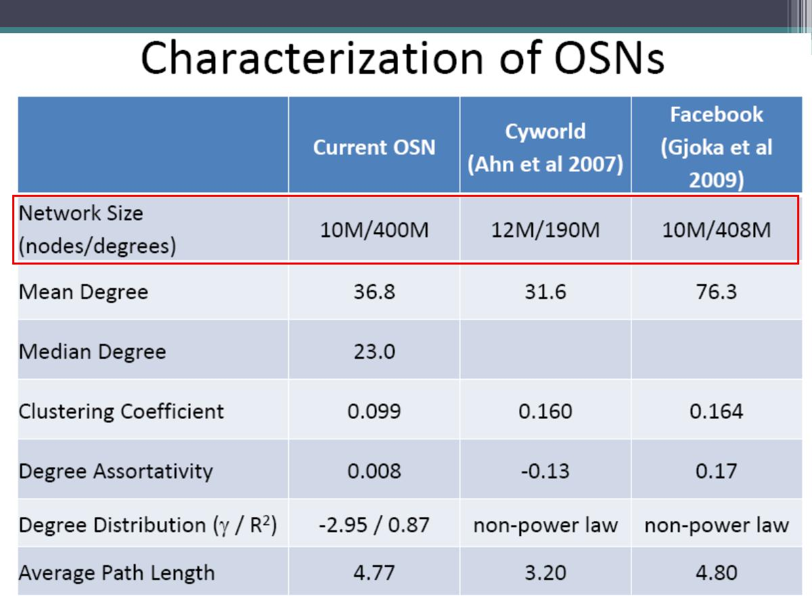

% 大规模社交网络的抽样及其应用
% 大连民族学院  许小可 
% 2013/04/11

# 为什么要抽样

- 数据量太大，获得总体数据比较困难或代价很高

- 厂商为了保护用户隐私和商业秘密不愿意提供总体数据

- 即使能得到总体数据，研究者处理起来也很困难

- 能否从总体中取出一些样本来进行分析和研究

- 抽样是社会学研究中最常用的技术和手段

# 抽样的定义和好处

在统计学中，抽样（Sampling）是一种统计推论方法，它是指从目标总体（Population，或称为母体）中抽取一部分个体作为样本（Sample），通过观察样本的某一或某些属性，依据所获得的数据对总体的数量特征得出具有一定可靠性的估计判断，从而达到对总体的认识。

- 获取数据代价比较小：尤其对于破坏性检测

- 可有效保护用户隐私和商业秘密

- 数据量小，容易存储和处理

# 案例：全国$1\%$人口抽样调查

参考：[http://news.xinhuanet.com/politics/2006-08/26/content_5009832.htm](http://news.xinhuanet.com/politics/2006-08/26/content_5009832.htm)

# 复杂系统和复杂网络

复杂网络是对复杂系统的抽象和描述方式，任何包含大量组成单元（或子系统）的复杂系统，当把构成单元抽象成节点、单元之间的相互关系抽象为边时，都可以当作复杂网络来研究。

# 各种不同领域的复杂网络

- 信息网络：WWW，Internet，Email网络

- 技术网络：电力网，论文引用网，电话线路网

- 交通运输网：航线网，铁路网，公路网，自然河流网

- 生物网：食物链网，神经网，蛋白质网，基因网络

- 社会网：演员合作网，友谊网，婚恋网，科研合作网

# 由复杂网络分析时间序列特性

# 复杂系统进行抽样的困难

# 复杂网络抽样的困难

每个人的身高、体重、财产进行抽样时只依赖于**个体本身**；而对每个人的朋友数量进行抽样的时候，不但依赖于个体也依赖于**和他发生关系的个体**，小范围和大范围的抽样结果相差很大。

- 无法进行随机抽样：很难找到有效的样本空间

- 亚里士多德：整体大于部分之和

- more is different：个体之间存在依赖性

- 很强的时变特性：网络结构、节点活跃特性动态变化快

# 传统社交网络：小样本精细研究

# Online Social networks and Mideas

- 人人网

- 新浪微博

- QQ、微信、陌陌

- facebook

- Twitter

- Google+

- 用户数量太大！！！！

# 在线社交网络上的抽样问题

从社交媒体（新浪微博、Twitter）或社交网站（Facebook、人人网）上中抽取一部分个体作为样本（Sample），依据所获得的样本集合的属性来推断总体的宏观统计特性：

- 平均度：用户平均有多少个朋友

- 聚类系数：用户的朋友之间是朋友的概率

- 匹配系数：物以类聚，人以群分是否成立

- 用户的总量和每个月新增用户的数量

- 用户的活跃度

- 。。。。。。。。。。

# 常见的社交网络抽样方法

- 直接抽样方法：针对节点或连边的简单随机抽样方法

- 间接抽样方法：基于网络链接关系进行抽样的方法

# 针对节点的简单随机抽样法

# 常见的网络遍历方式抽样

- 宽（广）度优先搜索，也可以叫滚雪球抽样

- 深度优先搜索

- 森林火灾方式 (Forest Fire)

- 应答驱动抽样 (Respondent-Driven Sampling)

- 基于随机游走的抽样

# 宽度优先搜索抽样法-滚雪球

# 应答驱动抽样-RDS

# 简单（无偏）随机游走抽样

简单随机游走偏向于抽取度大节点：抽取概率和节点度成正比。

# 为什么你朋友的好友比你多?

[1]: S. L. Feld, Why your friends have more friends than you do, American Journal of Sociology, Vol. 96, No. 6 (May 1991), pp. 1464–1477.

# MH有偏随机游走抽样法

MHRW方法在随机游走的时候以一定的概率偏向于度低的节点

# 有偏随机行走抽样

# 使用哪些统计量来衡量抽样效果

[1] 平均度：Mean Degree

[2] 聚类系数: Clustering Coefficient

[3] 匹配系数：Assortativity Coefficient

# 待抽样网络统计特性

# 节点的两个度信息：内部VS外部

# 社交网络上新的有用信息

# 平均度：Mean Degree

# 聚类系数Clustering Coefficient

# 匹配性Assortativity Coefficient

# 偏向小度节点$\alpha=-1$的结果分析

# 10所用户最多高校情况分析

# 研究小结

- 系统分析了用户个体的两个度信息对于常用复杂网络抽样方法的影响

- 综合比较各种抽样方法的结果，在利用用户度信息的情况下，发现偏向度小节点的有偏随机行走方式是比较有效的抽样方式

- 研究了基于用户大学信息的抽样网络，分析了两种情况下抽样网络的的边界效应和系统性偏差

# 正在做的工作

- 不需知道所有邻居信息，仅使用被抽样节点的信息

- 自适应选择最优$\alpha$的抽样方法

- 社交网络行为数据的抽样方法

# 抽样的思考和典型应用

- 大数据分析时代需要抽样吗？

- 如何使用抽样来估计总体的数量

- 抽样对于信息传播的影响

- 抽样对于链路预测的影响

- 抽样对社团结构检测的影响

- 。。。。。。。。。

# 大数据分析和抽样并不矛盾

- 分布式(map-reduce）计算技术的发展

- 实时处理（流计算，内存计算）的发展

- 总体数据分析成为可能

- 从效率和成本的角度考虑，适当理的抽样是必要的

- 绝大多数**大数据**其实还是抽样数据

# 使用抽样来估计总体的数量

- 二战时德军坦克数量估计

- 种群密度的常用调查方法：标志重捕法

- 使用标志重捕法追踪美元研究人类动力学和疾病传播

- 估计自然界中物种的数量：极大似然估计法

- 可利用上面方法估计社交网络的用户数量

- 新问题：如何使用抽样方式估计社交网络中活跃用户的数量

# 重捕获边VS重捕获节点

[1] Kurant M, Butts C T, Markopoulou A. Graph Size Estimation[J]. arXiv preprint arXiv:1210.0460, 2012.

# 信息传播的拓扑结构

[1] Munmun De Choudhury, Yu-Ru Lin, Hari Sundaram,K. Selcuk Candan, Lexing Xie, Aisling Kelliher,How Does the Data Sampling Strategy Impact the Discovery of Information Diffusion in Social Media? Proceedings of the Fourth International AAAI Conference on Weblogs and Social Media,2010.

# 抽样方法对于信息传播的影响1

# 抽样方法对于信息传播的影响2

# 链路预测的基本思想

# 抽样对于链路预测方法的影响

[1]Jichang Zhao, Xu Feng, Li Dong, Xiao Liang and Ke Xu. Performance of local information-based link prediction: a sampling perspective, J. Phys. A: Math. Theor. 45 (2012) 345001

# 总结：抽样无处不在

- 数据无处不在：data，data，data

- 有数据就有意味着可以试试抽样

- 未来社交网络的研究一定要使用抽样技术

- 抽样技术的发展会进一步体现数据的力量

# 传统社会学：小而精致

# 系统科学研究：大而粗糙

# 期待学科融合：大而精致的研究

homepage：[http://www.eie.polyu.edu.hk/~xuxk/](http://www.eie.polyu.edu.hk/~xuxk/)

E-mail：[xiaokeeie@gmail.com](xiaokeeie@gmail.com)

# 问题和讨论

